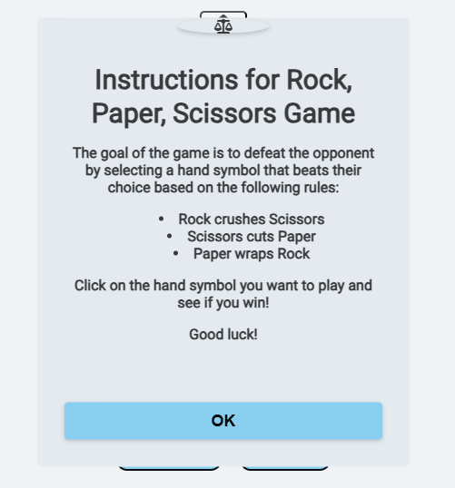
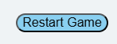

# Rock Paper Scissors Game

This project is a browser-based Rock Paper Scissors game where players can compete against the computer in a best-of-five series. The game provides a clean user interface with buttons for each choice and a scoring system to track the results.

## Live Demo
- **Homepage**: <a href="https://bjoernholmlund.github.io/rock-paper-scissor/index.html">Homepage</a>
* **Game Page**: <a href="https://bjoernholmlund.github.io/rock-paper-scissor/game.html">Gamepage</a>

## Features

### Existing Features
- **Home button** At the top of the page, theres a home button that takes u to the homepage.  

* **Header**: At the top of the page underneath the home button, theres a header.
              The header says what game you are playing.  

+ **Game Page**: Players can select rock, paper, or scissors. The game displays both the player and computer choices, updates scores, and declares a winner after five rounds.   
    

- **Score Tracking**: Visual score tracking for both player and computer.   
    

* **Popup Instructions**: Instructions are available to help new players understand the game.  
   

+ **Reset Function**: Resets scores and rounds, allowing players to start a new match at any time.  
  
## Technologies Used
- **HTML**: Structure of the website.
* **CSS**: Styling for layout, color, and background.
+ **JavaScript**: Game logic, including random computer choices and score updates.

## Testing

### Bugs

### Validator Testing

- HTML 
  - No errors or warnings were showned, when doing the <a href="https://validator.w3.org/">W3 Validator</a>
* CSS
  - No errors or warnings were found, when doing the <a href="https://jigsaw.w3.org/css-validator/">W3 jigsaw validator</a>
+ JavaScript
  - No errors or warnings were found, when doing the <a href="https://jshint.com/">jshint</a>
  - Metrics:
  - There are 4 functions in this file.
  - Function with the largest signature take 1 arguments, while the median is 0.
  - Largest function has 25 statements in it, while the median is 4.
  - The most complex function has a cyclomatic complexity value of 14 while the median is 1