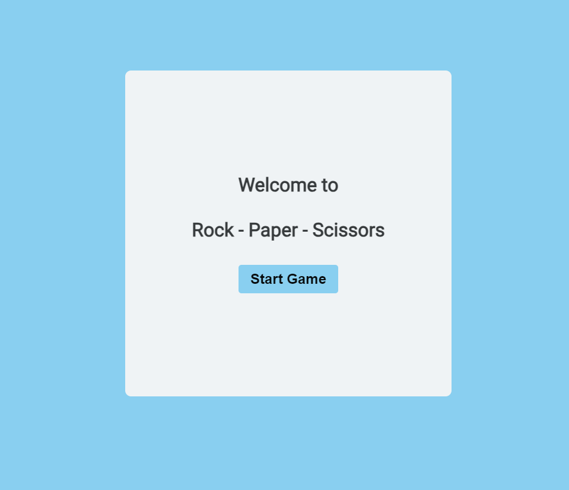

# Rock Paper Scissors Game

## Overview
This project is a browser-based Rock Paper Scissors game where players can compete against the computer in a best-of-five series. The game provides a clean user interface with buttons for each choice and a scoring system to track the results.

## Live Demo
Homepage: Rock Paper Scissors Homepage
Game Page: Play the Game

## Features
**Homepage**: A welcoming page introducing the game.

**Game Page**: Players can select rock, paper, or scissors. The game displays both the player and computer choices, updates scores, and declares a winner after five rounds.

**Score Tracking**: Visual score tracking for both player and computer.  

**Popup Instructions**: Instructions are available to help new players understand the game.

**Reset Function**: Resets scores and rounds, allowing players to start a new match at any time.

## Technologies Used
**HTML**: Structure of the website.
**CSS**: Styling for layout, color, and background.
**JavaScript**: Game logic, including random computer choices and score updates.

Alternatively, you can play the game here.

Gameplay
Select a Move: Choose rock, paper, or scissors.
Round Result: The result will be shown after each choice, displaying both the player and computer's moves.
Scores: Track the scores displayed on the screen.
End of Game: After 5 rounds, a message will declare the final winner or announce a tie.
Reset Option: Click the reset button to start a new game.
Project Structure
index.html: The landing page for the game.
game.html: The main game interface.
style.css: Styling and layout.
script.js: JavaScript for handling game logic and user interactions.
assets/: Folder containing images and icons.
Future Enhancements
Difficulty Levels: Add easy, medium, and hard modes.
Sound Effects: Add audio feedback on button clicks and results.
Score History: Display past game results for the player.
License
This project is open-source and available under the MIT License.